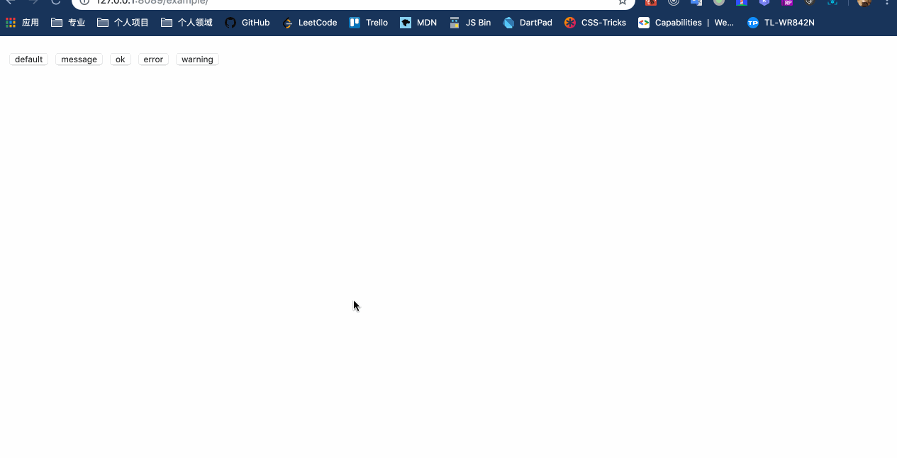

# React Easy Toast

 

可快速简单使用的 React Toast 组件



```bash
$ yarn add react-easy-toast --save
```

```javascript
import React from "react";
import ReactDOM from "react-dom";
import * as toast from "../lib";

console.log(toast);

class App extends React.Component{
  onToast(key){
    toast[key](key);
  }
  render(){
    return (
      <div className="container">
        <button onClick={this.onToast.bind(this, "show")}>default</button>
        <button onClick={this.onToast.bind(this, "message")}>message</button>
        <button onClick={this.onToast.bind(this, "ok")}>ok</button>
        <button onClick={this.onToast.bind(this, "error")}>error</button>
        <button onClick={this.onToast.bind(this, "warning")}>warning</button>
      </div>
    );
  }
}

ReactDOM.render(
  <App/>,
  document.querySelector('#app')
);
```

## LICENSE

MIT License Copyright (c) 2019 子曰五溪